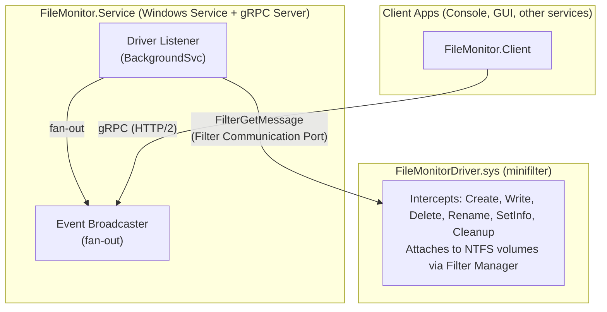

# FileMonitor

A Windows file system monitoring solution with three components:

1. **Minifilter Kernel Driver** — intercepts file I/O at the kernel level
2. **Windows Service** — receives events from the driver and exposes them via gRPC
3. **Client Library** — any application can subscribe to real-time file events

---

## Prerequisites

| Requirement | Details |
|---|---|
| OS | Windows 10/11 x64, or Windows Server 2016+ |
| Visual Studio | 2022 or later, with **Desktop development with C++** workload |
| .NET SDK | 8.0 or later (`winget install Microsoft.DotNet.SDK.8`) |
| Windows SDK | 10.0.26100.0+ (installed with Visual Studio) |
| WDK Headers/Libs | Windows Driver Kit — the `km` include and lib directories must be present under `C:\Program Files (x86)\Windows Kits\10` |
| Test Signing | Required for loading unsigned drivers during development |

---

## 1. Compile

All build outputs go to the `bin\` directory at the repository root.
Intermediate files go to `build\obj\`.

### Build everything (single command)

```powershell
dotnet build FileMonitor.sln -c Debug
```

This single command builds **all four projects** — the minifilter driver, Windows Service, Client Library, and Sample App. The driver is compiled automatically as a pre-build step of the Service project using the kernel-mode MSVC toolchain.

For a Release build:

```powershell
dotnet build FileMonitor.sln -c Release
```

### Build output

| Component | Path |
|---|---|
| Driver | `bin\Debug\x64\FileMonitorDriver.sys` |
| Driver INF | `bin\Debug\x64\FileMonitorDriver.inf` |
| Windows Service | `bin\Debug\net8.0-windows\win-x64\FileMonitor.Service.exe` |
| Client Library | `bin\Debug\net8.0\FileMonitor.Client.dll` |
| Sample App | `bin\Debug\net8.0\FileMonitor.SampleApp.exe` |
| Deployment Scripts | `bin\Debug\scripts\*.bat` |

### Build the driver only

```powershell
.\scripts\Build-Driver.ps1 -Configuration Debug
```

---

## 2. Deploy

All deployment steps require an **Administrator** command prompt.

### 2.1 Enable test signing (one-time setup)

Unsigned drivers require test signing mode. Run once and reboot:

```cmd
bcdedit /set testsigning on
shutdown /r /t 0
```

### 2.2 Install the driver

```cmd
scripts\Install-Driver.bat .\bin\Debug\x64\FileMonitorDriver.sys .\bin\Debug\x64\FileMonitorDriver.inf
```

This will:
1. Copy `FileMonitorDriver.sys` to `%SystemRoot%\system32\drivers\`
2. Register the driver via the INF file
3. Load the minifilter with `fltmc load`

Verify the driver is loaded:

```cmd
fltmc filters
```

You should see `FileMonitorDriver` with altitude `370020`.

### 2.3 Install the Windows Service

```cmd
scripts\Manage-Service.bat install .\bin\Debug\net8.0-windows\win-x64\FileMonitor.Service.exe
```

Start the service:

```cmd
scripts\Manage-Service.bat start
```

Check its status:

```cmd
scripts\Manage-Service.bat status
```

The service listens on `http://localhost:50051` (gRPC over HTTP/2).

---

## 3. Execute

### 3.1 Run the sample client

With the driver loaded and the service running:

```powershell
dotnet run --project src\FileMonitor.SampleApp
```

Or run the compiled executable directly:

```cmd
bin\Debug\net8.0\FileMonitor.SampleApp.exe
```

The console shows real-time file events with color coding:
- **Green** — file created
- **Yellow** — file written
- **Red** — file deleted
- **Cyan** — file renamed

Interactive keyboard controls:

| Key | Action |
|---|---|
| `S` | Stop monitoring |
| `R` | Resume monitoring |
| `Q` | Quit |

### 3.2 Use the client library from your own code

Reference `FileMonitor.Client` in your project:

```xml
<ProjectReference Include="path\to\FileMonitor.Client\FileMonitor.Client.csproj" />
```

Then subscribe to events:

```csharp
using FileMonitor.Client;
using FileMonitor.Grpc;

using var client = new FileMonitorClient("http://localhost:50051");

client.OnFileEvent += evt =>
{
    Console.WriteLine($"{evt.EventType} {evt.FilePath} by PID {evt.ProcessId}");
};

client.StartSubscription();

// Control monitoring from the client
await client.StopMonitoringAsync();    // pause
await client.StartMonitoringAsync();   // resume

// Query status
var status = await client.GetStatusAsync();
Console.WriteLine($"Driver connected: {status.IsDriverConnected}");
Console.WriteLine($"Events processed: {status.EventsProcessed}");
Console.WriteLine($"Subscribers: {status.ActiveSubscribers}");
```

Filter events by type and path:

```csharp
client.StartSubscription(
    eventFilter: (uint)(FileEventType.FileEventWrite | FileEventType.FileEventDelete),
    pathFilter: @"\Device\HarddiskVolume3\Users"
);
```

### 3.3 Service management commands

All commands require an Administrator command prompt:

```cmd
scripts\Manage-Service.bat stop       &REM Stop the service
scripts\Manage-Service.bat start      &REM Start the service
scripts\Manage-Service.bat status     &REM Show service status
scripts\Manage-Service.bat uninstall  &REM Remove the service
```

---

## 4. Uninstall

Remove everything (Administrator command prompt):

```cmd
REM 1. Stop and remove the Windows Service
scripts\Manage-Service.bat uninstall

REM 2. Unload and remove the driver
scripts\Uninstall-Driver.bat

REM 3. Optionally disable test signing
bcdedit /set testsigning off
```

---

## Architecture



## Project Structure

```
driverproject/
├── Directory.Build.props               # Redirects all .NET output to bin\
├── Directory.Build.targets             # Driver pre-build + deployment file copy
├── FileMonitor.sln
├── proto/
│   └── file_monitor.proto              # gRPC service + message definitions
├── src/
│   ├── driver/FileMonitorDriver/
│   │   ├── shared.h                    # Shared structures (driver ↔ service)
│   │   ├── driver.h / driver.c         # Minifilter implementation
│   │   ├── FileMonitorDriver.inf       # Driver install manifest
│   │   └── FileMonitorDriver.vcxproj
│   ├── FileMonitor.Service/            # Windows Service (.NET 8)
│   │   ├── Driver/                     # P/Invoke + communication layer
│   │   ├── Services/                   # gRPC service + event broadcaster
│   │   └── Program.cs
│   ├── FileMonitor.Client/             # Client library
│   │   └── FileMonitorClient.cs
│   └── FileMonitor.SampleApp/          # Demo console application
│       └── Program.cs
├── scripts/
│   ├── Build-Driver.ps1                # Compile the driver (called automatically)
│   ├── Install-Driver.bat              # Deploy the driver
│   ├── Uninstall-Driver.bat            # Remove the driver
│   └── Manage-Service.bat             # Install/start/stop/uninstall service
└── bin\                                # All build outputs
    └── {Debug|Release}/
        ├── x64/                        # FileMonitorDriver.sys + .inf
        ├── net8.0/                     # Client + SampleApp
        ├── net8.0-windows/win-x64/     # Service
        └── scripts/                    # Deployment .bat files
```
