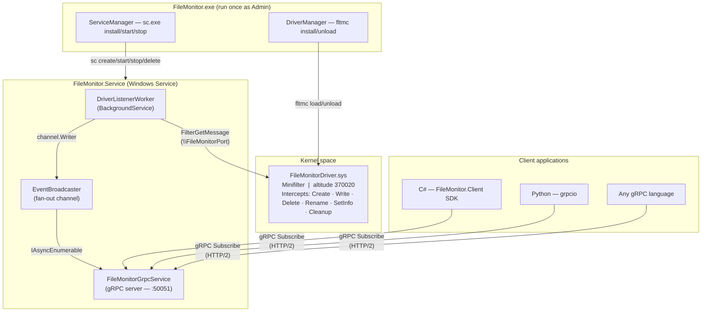

# FileMonitor

**FileMonitor** is a Windows kernel-level file system monitor. It ships as a single self-contained executable that installs everything needed and exposes real-time file events over gRPC so any application — C#, Python, or any gRPC-capable language — can subscribe to them.

```
FileMonitor.exe  (run as Admin)
      │
      ├─ installs FileMonitorDriver.sys  (minifilter kernel driver, altitude 370020)
      └─ installs + starts FileMonitor.Service  (Windows Service → gRPC on :50051)
                                                          │
                                  ┌───────────────────────┤
                                  │                       │
                           C# SDK client          Python gRPC client
                      (FileMonitor.Client.dll)   (or any language)
```

---


## 1. How to Use

### Prerequisites

| Requirement | Details |
|---|---|
| OS | Windows 10/11 x64 or Windows Server 2016+ |
| Privilege | Must run as **Administrator** |
| Test signing | Required for unsigned drivers during development — see below |

### 1.1 Enable test signing (development machines only, one-time)

Drivers must be signed to load on Windows. For development, enable test signing mode and reboot:

```cmd
bcdedit /set testsigning on
shutdown /r /t 0
```

> **Production deployments** require a proper EV code-signing certificate and WHQL submission.

### 1.2 Download and extract the release

1. Go to the [Releases](https://github.com/jrpally/drivermonitoring/releases) page and download the latest `FileMonitor-vX.Y.Z-win-x64.zip`.

2. Extract it — right-click the zip in Explorer and choose **Extract All**, or use PowerShell:

   ```powershell
   Expand-Archive -Path FileMonitor-v1.0.0-win-x64.zip -DestinationPath C:\FileMonitor
   ```

3. After extraction the layout is:

   ```
   C:\FileMonitor\
   ├── installer\
   │   └── FileMonitor.exe          ← the all-in-one launcher (run this)
   ├── client\
   │   ├── FileMonitor.Client.dll   ← C# SDK — reference this from your project
   │   └── FileMonitor.Client.deps.json
   ├── driver\
   │   ├── FileMonitorDriver.sys
   │   └── FileMonitorDriver.inf
   └── scripts\
       ├── Install-Driver.bat
       ├── Uninstall-Driver.bat
       └── Manage-Service.bat
   ```

### 1.3 Run FileMonitor.exe

Open an **elevated** (Administrator) terminal and run:

```cmd
C:\FileMonitor\installer\FileMonitor.exe
```

It will automatically:

1. Extract and install `FileMonitorDriver.sys` (the kernel minifilter)
2. Extract `FileMonitor.Service.exe` to `%ProgramData%\FileMonitor\`
3. Register and start it as a Windows Service named **FileMonitorService**
4. Print the gRPC endpoint and wait

```
╔═══════════════════════════════════════════════════╗
║          FileMonitor  —  Rene Pally              ║
║  Kernel-level file system monitor  |  gRPC/HTTP2 ║
╚═══════════════════════════════════════════════════╝

Extracting driver...      OK
Installing driver...      OK
Extracting service...     OK
Installing service...     OK
Starting service...       OK

  FileMonitor is running.
  gRPC endpoint:  http://localhost:50051
  Install path:   C:\ProgramData\FileMonitor

  Connect with FileMonitor.Client (C#) or any gRPC client.
  See live/examples/ for Python and C# samples.

  Press Ctrl+C to stop the service and uninstall everything.
```

Press **Ctrl+C** to stop. This stops the service, unloads the driver, and removes all installed files.

### 1.4 Verify the driver is loaded

```cmd
fltmc filters
```

You should see `FileMonitorDriver` at altitude `370020`.

---

## 2. How to Develop a Client

FileMonitor exposes a **gRPC server** on `http://localhost:50051`. Any gRPC-capable language can connect to it. The service definition is in [proto/file_monitor.proto](proto/file_monitor.proto).

### 2.1 C# — FileMonitor.Client SDK

The SDK (`FileMonitor.Client.dll`) is included in every release zip under `client\`.  
Full guide, code samples, and API reference: **[live/examples/csharp/README.md](live/examples/csharp/README.md)**

Quick look:

```csharp
using FileMonitor.Client;

using var client = new FileMonitorClient("http://localhost:50051");
client.OnFileEvent += evt => Console.WriteLine($"[{evt.EventType}] {evt.FilePath}");
client.StartSubscription();   // non-blocking

Console.ReadLine();
```

### 2.2 Python — grpcio

Generate stubs from the proto file and connect with `grpcio`.  
Full guide including stub generation, filtering, timestamp decoding, and control RPCs: **[live/examples/python/README.md](live/examples/python/README.md)**

Quick look:

```python
import grpc, file_monitor_pb2, file_monitor_pb2_grpc

with grpc.insecure_channel("localhost:50051") as ch:
    stub = file_monitor_pb2_grpc.FileMonitorServiceStub(ch)
    for event in stub.Subscribe(file_monitor_pb2.SubscribeRequest()):
        print(f"[{event.event_type}] {event.file_path}")
```

### 2.3 Any other language

Generate stubs from [proto/file_monitor.proto](proto/file_monitor.proto) using the standard `protoc` compiler with your language's gRPC plugin and connect to `localhost:50051`. The service exposes four RPCs:

| RPC | Type | Description |
|---|---|---|
| `Subscribe` | Server streaming | Receive a continuous stream of `FileEvent` messages |
| `StartMonitoring` | Unary | Tell the driver to start intercepting I/O |
| `StopMonitoring` | Unary | Tell the driver to pause |
| `GetStatus` | Unary | Query driver connection, event counters, subscriber count |

---

## 3. Technical Details

### 3.1 Architecture



### 3.2 Components

| Component | Technology | Role |
|---|---|---|
| `FileMonitor.exe` | .NET 8, `net8.0-windows`, self-contained | One-shot installer: extracts driver + service, manages lifecycle |
| `FileMonitorDriver.sys` | C, WDM/WDK, kernel-mode | Minifilter driver — intercepts I/O at altitude 370020 |
| `FileMonitor.Service.exe` | .NET 8 Windows Service, ASP.NET Core gRPC | Reads driver events, broadcasts to gRPC subscribers |
| `FileMonitor.Client.dll` | .NET 8 library | C# SDK — wraps the gRPC stubs, raises `OnFileEvent` |
| `proto/file_monitor.proto` | Protobuf 3 | Source of truth for the wire protocol |

### 3.3 Kernel driver internals

`FileMonitorDriver.sys` is a Windows **minifilter** registered with the Filter Manager at altitude `370020`. It attaches to all NTFS volumes on startup.

For each intercepted operation (IRP), a post-operation callback populates a `FILE_MONITOR_NOTIFICATION` and sends it to user mode via `FltSendMessage` through the named communication port `\FileMonitorPort`.

```c
// shared.h — wire format between driver and service
typedef struct _FILE_MONITOR_NOTIFICATION {
    ULONG         EventType;          // FILE_MONITOR_EVENT_TYPE bitmask
    ULONG         ProcessId;
    ULONG         ThreadId;
    LARGE_INTEGER Timestamp;          // FILETIME-compatible (100ns ticks, UTC)
    ULONG         FilePathLength;     // byte count of FilePath
    WCHAR         FilePath[1024];     // full NT path, e.g. \Device\HarddiskVolume3\...
} FILE_MONITOR_NOTIFICATION;
```

Intercepted operations:

| Operation | Hook point | Event type |
|---|---|---|
| `IRP_MJ_CREATE` | Post-op | `FileEventCreate` |
| `IRP_MJ_CLOSE` | Post-op | `FileEventClose` |
| `IRP_MJ_READ` | Post-op | `FileEventRead` |
| `IRP_MJ_WRITE` | Post-op | `FileEventWrite` |
| `IRP_MJ_SET_INFORMATION` | Post-op | `FileEventSetInfo` / `FileEventRename` / `FileEventDelete` |
| `IRP_MJ_CLEANUP` | Post-op | `FileEventCleanup` |

The driver also exposes a control channel: user mode can send a `FILE_MONITOR_COMMAND` (`CommandStartMonitoring` / `CommandStopMonitoring`) via `FilterSendMessage`, which toggles event capture globally.

### 3.4 Service internals

`FileMonitor.Service` is a .NET 8 ASP.NET Core application hosted as a Windows Service (`UseWindowsService`).

- **`DriverListenerWorker`** — a `BackgroundService` that calls `FilterGetMessage` in a tight loop, converts raw `FILE_MONITOR_NOTIFICATION` structs to proto `FileEvent` messages, resolves process names via `OpenProcess`/`QueryFullProcessImageName`, and writes them to an `EventBroadcaster` channel.
- **`EventBroadcaster`** — a fan-out publisher backed by `System.Threading.Channels`. Each active gRPC subscriber gets its own `ChannelReader<FileEvent>`.
- **`FileMonitorGrpcService`** — implements the `FileMonitorService` proto service. `Subscribe` reads from the subscriber's channel and streams events; `StartMonitoring`/`StopMonitoring` send commands to the driver; `GetStatus` returns counters.

Kestrel is configured for **HTTP/2 only** on `localhost:50051` (no TLS — local-only by design):

```csharp
builder.WebHost.ConfigureKestrel(options =>
    options.ListenLocalhost(50051,
        lo => lo.Protocols = HttpProtocols.Http2));
```

### 3.5 FileMonitor.exe internals

`FileMonitor.exe` is a self-contained single-file executable (`PublishSingleFile=true`, `SelfContained=true`) that embeds both `FileMonitorDriver.sys` and `FileMonitor.Service.exe` as managed resources at build time.

At runtime it:

1. Checks for Administrator privilege
2. Creates `%ProgramData%\FileMonitor\`
3. Uses `DriverManager` to extract the driver, copy it to `%SystemRoot%\System32\drivers\`, register the INF, and call `fltmc load`
4. Uses `ServiceManager` to extract the service exe, run `sc.exe create ... start= demand type= own`, then `sc.exe start`
5. Waits indefinitely on a `CancellationToken`
6. On Ctrl+C: `sc.exe stop` → `sc.exe delete` → `fltmc unload` → delete `%ProgramData%\FileMonitor\`

### 3.6 Build system

```
Directory.Build.props   — sets BaseOutputPath = bin\, BaseIntermediateOutputPath = build\obj\
                          defines default Version=1.0.0 (overridden by CI)
Directory.Build.targets — BuildDriver MSBuild target: calls Build-Driver.ps1
                          guarded by SkipBuildDriver=true to prevent double execution
scripts\Build-Driver.ps1 — compiles the minifilter using kernel-mode MSVC + WDK headers
                            resolves wdk km/ and shared/ includes independently by version
```

### 3.7 CI/CD

The GitHub Actions workflow (`.github/workflows/release.yml`) runs on every push to `main` or `development`, and on `v*.*.*` tags.

| Step | What happens |
|---|---|
| Resolve version | Tags → `1.2.3` / branches → `0.0.0-main.<sha>` |
| Install WDK | Downloads from Microsoft, extracts to `C:\WDK` |
| Build minifilter | Runs `Build-Driver.ps1 -Configuration Release` |
| `dotnet build` | Builds all .NET projects (`SkipBuildDriver=true`) |
| Publish service | `dotnet publish FileMonitor.Service -r win-x64 --self-contained /p:PublishSingleFile=true` → `bin\Release\publish\service\` |
| Publish FileMonitor.exe | `dotnet publish FileMonitor.Live -r win-x64 --self-contained /p:PublishSingleFile=true` — embeds driver + service |
| Package | Zips `FileMonitor.exe`, driver binaries, `FileMonitor.Client.dll`, scripts |
| Upload artifact | Every build — available as a workflow artifact |
| GitHub Release | Tags only — attaches the zip to a release |

### 3.8 Project structure

```
driverproject/
├── Directory.Build.props          # Centralised output paths + version defaults
├── Directory.Build.targets        # BuildDriver MSBuild target
├── FileMonitor.sln
├── proto/
│   └── file_monitor.proto         # gRPC service definition (source of truth)
├── src/
│   ├── driver/FileMonitorDriver/
│   │   ├── shared.h               # Kernel ↔ user-mode wire format
│   │   ├── driver.h / driver.c    # Minifilter implementation
│   │   └── FileMonitorDriver.inf  # Driver install manifest (altitude 370020)
│   ├── FileMonitor.Live/          # FileMonitor.exe — installer/launcher
│   │   ├── DriverManager.cs       # Driver extract + fltmc install/unload
│   │   ├── ServiceManager.cs      # sc.exe-based service lifecycle
│   │   └── Program.cs
│   ├── FileMonitor.Service/       # Windows Service — gRPC server
│   │   ├── Driver/                # FilterCommunicationPort P/Invoke
│   │   └── Services/              # DriverListenerWorker, EventBroadcaster, gRPC impl
│   ├── FileMonitor.Client/        # C# SDK
│   │   └── FileMonitorClient.cs
│   └── FileMonitor.SampleApp/     # Demo console app
└── live/examples/
    ├── csharp/                    # C# client example (FileMonitor.Client)
    └── python/                    # Python client example (grpcio)
```

